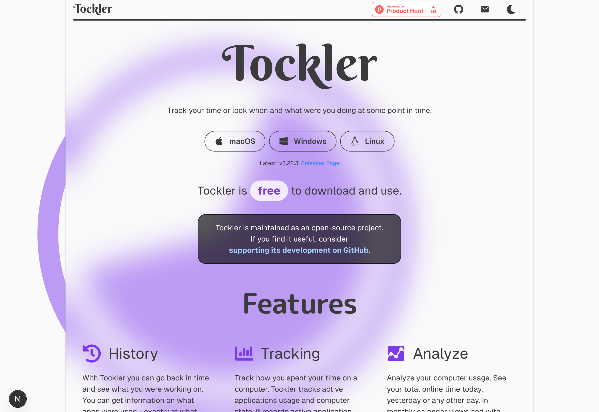

# Tockler Website



This is a modern [Next.js](https://nextjs.org) project bootstrapped with [`create-next-app`](https://nextjs.org/docs/app/api-reference/cli/create-next-app), utilizing Next.js 15 with React 19 and TypeScript.

## Features

-   🚀 Built with Next.js 15 and React 19
-   🎨 Styled with Chakra UI v3
-   🌓 Dark/Light mode support with next-themes
-   📱 Responsive design
-   📊 Analytics with Vercel
-   🗺️ Automatic sitemap generation
-   🔍 SEO optimized
-   ⚡ Turbopack for fast development

## Getting Started

### Prerequisites

-   Node.js (Latest LTS version recommended)
-   pnpm (Package manager)

### Installation

1. Clone the repository:

    ```bash
    git clone https://github.com/yourusername/tockler-webpage.git
    cd tockler-webpage
    ```

2. Install dependencies:
    ```bash
    pnpm install
    ```

### Development

Run the development server with Turbopack:

```bash
pnpm dev
```

Open [http://localhost:3000](http://localhost:3000) with your browser to see the result.

### Available Scripts

-   `pnpm dev` - Start the development server with Turbopack
-   `pnpm build` - Build the application for production
-   `pnpm start` - Start the production server
-   `pnpm lint` - Run ESLint for code linting
-   `pnpm postbuild` - Generate sitemap (runs automatically after build)

## Project Structure

The project follows the standard Next.js 13+ App Router structure:

```
src/
├── app/          # App router pages and layouts
├── components/   # Reusable React components
├── lib/         # Utility functions and configurations
└── styles/      # Global styles and theme configurations
```

## Technologies

-   **Framework:** Next.js 15.2.0
-   **UI Library:** React 19
-   **Styling:** Chakra UI 3.8.1
-   **Language:** TypeScript
-   **Package Manager:** pnpm
-   **Development Server:** Turbopack
-   **Code Quality:** ESLint, Prettier
-   **Analytics:** Vercel Analytics

## Contributing

Contributions are welcome! Please feel free to submit a Pull Request.

## License

This project is licensed under the MIT License - see the LICENSE file for details.
